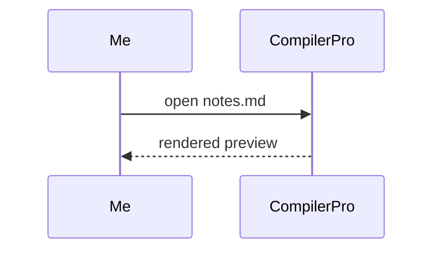

# Notes

Inline math $a^2 + b^2 = c^2$ and a display block:

$$
\nabla \cdot \mathbf{E} = \frac{\rho}{\varepsilon_0}
$$

## Diagram

```mermaid
sequenceDiagram
  Me->>CompilerPro: open notes.md
  CompilerPro-->>Me: rendered preview
```

## Safety check

- [ ] a task
- **bold** and *italic*
